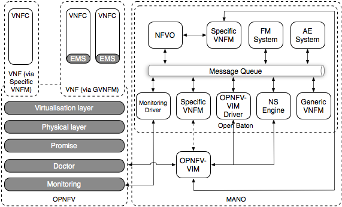

.. This work is licensed under a Creative Commons Attribution 4.0 International License.
.. http://creativecommons.org/licenses/by/4.0
.. (c) Fraunhofer FOKUS

Orchestra User Guide
====================

Orchestra description
---------------------

The OPNFV Orchestra project integrates the upstream open source Open Baton project within OPNFV.
Open Baton is the result of an agile design process having as major objective the development
of an extensible and customizable framework capable of orchestrating network services across heterogeneous NFV Infrastructures.

The main objective is to allow OPNFV users to get an Open Baton environment up and running using OPNFV installers.
Furthermore, the Orchestra team collaborates with testing projects in order
to include some scenarios for validating the actual integration between the
MANO stack provided by Open Baton and the OPNFV platform.

Orchestra capabilities and usage
--------------------------------

:numref:`opnfv-orchestra` below shows the Open Baton architecture integrating with the OPNFV platform.

Basically Open Baton manages a multi-site NFVI supporting heterogeneous virtualization and cloud technologies.
   Although OpenStack is the major supported VIM, it provides a driver mechanism for supporting additional VIM types.

Orchestra usage guidelines and example
--------------------------------------
Considering that there are no major differences between the Open Baton installed within
OPNFV platform and the upstream one, feel free to follow the upstram documentation provided
by the Open Baton project to learn more advanced use cases: http://openbaton.github.io/documentation/

Here, it is provided a small example to get started immediately. Depending on whether you have installed Orchestra yourself,
or using the JOID installer, you should retrieve the IP assigned to the Orchestra (host) where Open Baton has been installed.

The Open Baton dashboard is available on port 8080 (typically SSL is disabled within OPNFV installations): http://your-ip-here:8080

When accessing the dashboard, you will be prompted for a username and password.
The first access can only be done with the super user ("admin") created during the installation process (by default the password is "openbaton").
Please refer to the following documentation for learning how to use the Open Baton dashboard.
In addition, there is also a python CLI available which provides the same functions as the dashboard.
For simplicity, in this guide it is covered the usage of the dashboard only.

In order to use Open Baton for launching your own Network Service, assuming that
you have all the different components up and running, you will need to follow these steps:

* Register OPNFV as the Point of Presence (PoP)
* On board the SIPP client/server Network Service Descriptor (NSD)
* Launch the Network Service Record using the NSD created in the previous step

Register OPNFV as the Point of Presence
+++++++++++++++++++++++++++++++++++++++

In order to make use of your PoP you need to create a JSON file (see :download:`this example <descriptors/pop.json>`), and
you need to upload the JSON file to the NFVO. Please make sure you modify information about networks, images, and flavours inside
the NSD in order to get it working on your local setup.

You can use the dashboard available at http://your-ip-here:8080 for this purpose.
Under the menu Manage PoPs you can see the PoP instances.
Click on the Register VIM button and upload your JSON file (from the File input section).

Once the VIM instance is registered, it will appear on the list of available PoPs,
filled with the information regarding the available images, networks and flavors.
At this point, you are ready to use the OPNFV PoP in any NSDs and VNFDs.

On board the SIPP client/server Network Service Descriptor (NSD)
++++++++++++++++++++++++++++++++++++++++++++++++++++++++++++++++

Download the SIPp NSD using floating IPs (see :download:`this example <descriptors/nsd.json>`),
and upload it in the catalogue using the dashboard.

For uploading the NSD using the Dashboard go to Catalogue -> NS Descriptors and
choose the NSD of your choice by clicking on Upload NSD and selecting the Descriptor's json file.

Launch the Network Service Record using the NSD created in the previous step
++++++++++++++++++++++++++++++++++++++++++++++++++++++++++++++++++++++++++++

As soon as you onboarded the NSD in the NFVO you can deploy this NSD by using the dashboard.
You need to go to the GUI again and navigate to Catalogue -> NS Descriptors.
Open the drop down menu by clicking on Action. Afterwards you need to press the Launch button and a
window with launching options will appear. Just click on Launch again in order to start the deployment of this NSD.

This will create a Network Service Record (NSR) and actually launch the Virtual Machines on OpenStack.

Check the status of your Network Service Record
+++++++++++++++++++++++++++++++++++++++++++++++

If you go to Orchestrate NS -> NS Records in the menu on the left side,
you can follow the deployment process and check the current status of the created NSR.
